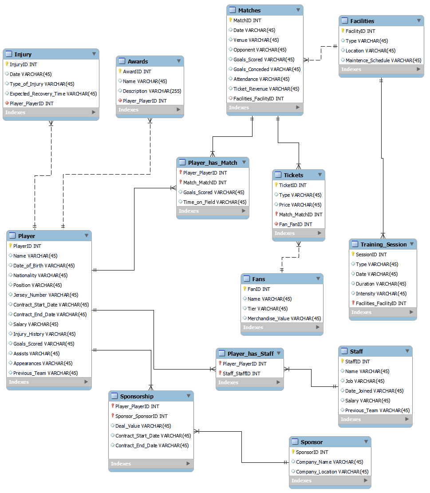
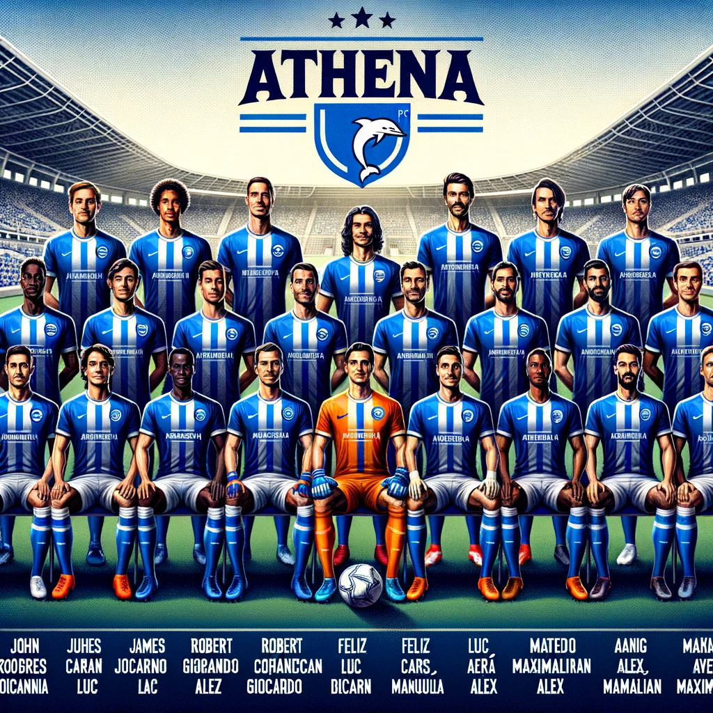

# AthenaFC-Database
# MIST 4610 (Data Management and Analytics) - Project 1

## Project Description 
This project involves a collaborative effort by the students of MIST 4610 class at the University of Georgia to construct a robust relational database for a simulated client scenario, facilitated through the ChatGPT interface at chat.openai.com. 

## Team Members
Tyson Colette [GitHub](https://github.com/TysonColette)

Dev Davey [GitHub](https://github.com/drd40790)

## Data Model Construction
In collaboration with the chosen client scenario via ChatGPT:

1. Identify crucial entities, attributes, and relationships specific to the client's business.
2. Document the data model using an Entity Relationship Diagram.
3. Create the database in MySQL and populate it with artifical data.
4. Craft SQL queries that give managerial insight into the clients business.

## 1. Conversation with ChatGPT
### Prompt:
Pretend you are the owner/operator of a soccer club needing to build a relational database. You hired some students from the MIST 4610 class [Data Management and Analytics] at the University of Georgia to create the database for you. They need to know more about
your organization to identify which entities, attributes, and relationships are important for
you. Start by describing your business as a real client.

### Reponse:
**Client Description:**

Hello students! I'm Alex Morgan, the owner and operator of "Athena FC", a professional soccer club based right here in Athens, Georgia. Our club competes in the Southeastern Soccer League, and we have both a men's and women's team. As we continue to grow and compete at higher levels, it's essential that we have a robust data management system to track various facets of our operations.

**Entities we believe are essential for our business:**

1. Players: They are the core of our club. Information about their playing statistics, personal details, contract specifics, and health is vital.

2. Staff: This includes coaches, medical staff, scouts, and administrative personnel.

3., Matches: Every match has a date, location, opponent, result, and statistics associated with it.

4. Training Sessions: These are conducted frequently, and data about their duration, intensity, players who attended, and performance metrics are tracked.

5. Fans: Our fan base is crucial for revenue and engagement. We have a membership system and track ticket sales, merchandise purchases, and attendance.

6. Facilities: We own a stadium and training grounds. Maintenance schedules, usage schedules, and other associated details are important.

7. Finances: This includes player salaries, revenue from ticket sales, sponsorships, merchandise sales, and expenses.

8. Sponsors: Companies that sponsor our club, the details of the deal, duration, and value.

9. Youth Academy: Young players who are being groomed for the future. Their development metrics, personal details, and performances are tracked.

**Attributes (examples for a few entities):**

1. Players: Name, Date of Birth, Nationality, Position, Jersey Number, Contract Start Date, Contract End Date, Salary, Injury History, Goals Scored, Assists, Appearances.

2. Matches: Date, Venue, Opponent, Goals Scored, Goals Conceded, Attendance, Ticket Revenue.

3. Fans: Name, Membership Type, Date of Birth, Date Joined, Total Matches Attended, Merchandise Purchased.

**Relationships (examples):**

1. Players-Staff: Players interact with various staff members. A player might have a primary coach, physiotherapist, or even a nutritionist.

2. Players-Matches: Which players played in which matches, their performance metrics for that match (e.g., goals scored, minutes played).

3. Fans-Matches: Which fans attended which matches, the type of tickets they purchased.

4. Facilities-Training Sessions: Which facility was used for which training session, any maintenance required post-session.

## 2. Creation of Entity Relationship diagram
After consulting with ChatGPT, the following database was drawn up, taking insight from what ChatGPT determined were valuable entities and attributes to model:


## 3. Populating the Database with Artificial Data 
### Player
The majority of the data was designed to be as realistic as possible.
For **Player** the aim was to design ficitonal players from all over the world and assign them a name that was suitable. There's even two French players with the same name!

These ficional players were created by ChatGPT using GPT-4.

Here is a sample of the **Player** data input:
```MySQL
Insert into Player 
(PlayerID, Name, Date_of_Birth, Nationality, Position, Jersey_Number, Contract_Start_Date, Contract_End_Date, Salary, Injury_History, Goals_Scored, Assists, Appearances, Previous_Team)
Values

-- Player 1 - U.S. Goalkeeper
(1, 'John Smith', '1995-02-15', 'United States', 'Goalkeeper (GK)', 1, '2022-03-20', '2025-03-20', 300000, 'ACL, Ankle Sprain', 0, 0, 28, 'Albany Alphas'),  

-- Player 2 - Brazilian Striker
(2, 'Luiz Alves', '1997-08-10', 'Brazil', 'Striker', 9, '2023-01-12', '2026-01-12', 4500000, 'Broken Leg, Concussion', 25, 15, 30, 'Denver Peaks'), 

-- Player 3 - English Central Midfielder
(3, 'James O''Connell', '1994-05-20', 'England', 'Central Midfielder (CM)', 8, '2022-10-15', '2025-10-15', 2500000, 'MCL, Broken Arm', 5, 8, 26, 'Juneau Waves'),   

-- Player 4 - U.S. Center-Back 
(4, 'Robert Anderson', '1993-04-28', 'United States', 'Center-Back (CB)', 4, '2022-09-10', '2025-09-10', 700000, 'Ankle Sprain, Hip Dislocation', 0, 0, 27, NULL),
```

After player data was entered it was determined that some players should be without injury history to better simulate a real scenario:

Update Player 
Set Injury_History = NULL 
Where PlayerID in (11, 8, 20, 42, 15, 16, 2, 5, 31, 29, 44, 13, 21, 22, 34, 47);

### Sponsor
Given that soccer teams are typically sponsored 8 companies were entered into the **Sponsor** table using hte following:
```MySQL
Insert into Sponsor (SponsorID, Company_Name, Company_Location)
Values

(1, 'Adidas', 'Herzogenaurach, Germany'),

(2, 'Emirates', 'Dubai, United Arab Emirates'),

(3, 'Chevrolet', 'Detroit, Michigan, USA'),

(4, 'Coca-Cola', 'Atlanta, Georgia, USA'),

(5, 'Mastercard', 'Purchase, New York, USA'),

(6, 'Budweiser', 'St. Louis, Missouri, USA'),

(7, 'Sony', 'Tokyo, Japan'),

(8, 'BP', 'London, United Kingdom');
```

The top players (determined by Salary) were given sponsorships varying from 12 to 24 Months and from $80,000 to $800,000.

### Facilties
The **Facilities** were inserted using the following:
```MySQL
Insert into Facilities
Values 

(1, 'Home Stadium', 'Athens, Georgia', 'Weekly'),

(2, 'Practice Facility', 'Athens, Georgia', 'Biweekly'),

(3, 'Medical Facility', 'Athens, Georgia', 'Weekly'),

(4, 'Corporate Office', 'Atlanta, Georgia', 'Biweekly'),

(5, 'Event Center', 'Athens, Georgia', 'Weekly');
```
### Matches
34 Games (designed to mimic the MLS schedule) were generated using the following rules:
1. All games are played on Thursdays and Saturdays
2. Games alternate between Home and Away
3. Ticket revenue will be determined by the product of attendance in a 62,000 person stadium and an average ticket price of $50
4. No team is to be played more than twice

This following sample was used to populate the **Matches** table:
```MySQL
Insert into Matches (MatchID, Date, Venue, Opponent, Goals_Scored, Goals_Conceded, Attendance, Ticket_Revenue, Facilities_FacilityID)
Values
(1, '2023-10-05', 'Home', 'Albany Alphas', 4, 1, '85%', 50 * 62000 * 0.85, 1),
(2, '2023-10-08', 'Away', 'Boston Beacons', 2, 3, '87%', 50 * 62000 * 0.87, NULL),
(3, '2023-10-12', 'Home', 'Galveston Galleons', 3, 4, '88%', 50 * 62000 * 0.88, 1),
(4, '2023-10-15', 'Away', 'Denver Peaks', 0, 2, '89%', 50 * 62000 * 0.89, NULL),
(5, '2023-10-19', 'Home', 'Juneau Waves', 4, 1, '90%', 50 * 62000 * 0.90, 1),
(6, '2023-10-22', 'Away', 'Fresno Pheonix', 3, 1, '88%', 50 * 62000 * 0.88, NULL),
(7, '2023-10-26', 'Home', 'Galveston Galleons', 4, 2, '92%', 50 * 62000 * 0.92, 1),
(8, '2023-10-29', 'Away', 'Hartford Harbingers', 0, 2, '87%', 50 * 62000 * 0.87, NULL),
(9, '2023-11-02', 'Home', 'Urbana Titans', 5, 0, '93%', 50 * 62000 * 0.93, 1),

```
### Fans
The **Fans** table was populated with the 999 best fans of the team. These 999 people were generated using Mockaroo

### Tickets
The **Tickets** table was then populated using the following statement:

```MySQL
--Insert Data
Insert into Tickets (Type, Price, Match_MatchID, Fan_FanID)
Select 
    -- Randomly assign ticket type, 50/50 Split
    Case 
        When rand() > 0.5 Then 'Upper Level'
        Else 'Lower Level'
    End as Type,
    -- Randomly assign ticket price, 50/50 Split
    Case 
        When rand() > 0.5 Then 30
        Else 60
    End as Price,
    Matches.MatchID as Match_MatchID,
    Fans.FanID as Fan_FanID
From
    Fans,
    (Select MatchID From Matches Where Date <= '2023-11-03' limit 9) as Matches;
```
The aim for this was to assign the 1000 fans tickets to the 9 Games that had already been played.
This was an imperfect method which does not tie the value of the ticket to the level of the seat, but instead generates a random value for each attribute.

### Rest of the Data
The rest of the data was generated using similar methods that tried to maintain accuracy as best as possible

## 4. Querying the Data
### Queries

#### Query 1:
**Purpose:**
This query calculates the cost per game for each player based on their salary, assuming they play 34 games. Managers can use this information to assess the cost-efficiency of their players and make informed decisions regarding player contracts and team budget allocation.

**Query:**
```MySQL
Select
    PlayerID,
    Name,
    concat('$', format((Salary / 34), 2)) as 'Salary per game'
From
    Player;
```
**Result:** *(Sample of 10/45 Players)*
| PlayerID      | Name      | Salary per game      |
|------------- | --------- | -------------------- |
| 1             | John Smith | $8,823.53            |
| 2             | Luiz Alves | $132,352.94          |
| 3             | James O'Connell | $73,529.41           |
| 4             | Robert Anderson | $20,588.24           |
| 5             | Carlos Hernandez | $25,000.00           |
| 6             | Felix Müller | $44,117.65           |
| 7             | Mateo Rodriguez | $55,882.35           |
| 8             | Giovanni Bianchi | $26,470.59           |
| 9             | Luc Dubois | $61,764.71           |
| 10            | Brian Johnson | $35,294.12           |

#### Query 2:
**Purpose:** 
 This query calculates the total number of goals scored by players from each country. Managers can gain insights into the goal-scoring performance of players from different nationalities, helping them assess the effectiveness of their scouting efforts and potentially identify areas for improvement.

**Query:**
```MySQL
Select
	Nationality,
	sum(Goals_Scored) as 'Total Goals'
From 
	Player
Group by
	Nationality
Order by
	'Total Goals' desc;
```
**Result:**
| Nationality      | Total Goals      |
| ---------------- | ---------------- |
| United States    | 65               |
| Brazil           | 64               |
| England          | 22               |
| Spain            | 4                |
| Germany          | 18               |
| Argentina        | 27               |
| Italy            | 9                |
| France           | 12               |
| Netherlands      | 8                |
| Portugal         | 7                |
| Nigeria          | 14               |
| Colombia         | 17               |
| Australia        | 17               |
| Mexico           | 6                |
  
#### Query 3:
**Purpose:** 
This query computes the average attendance and ticket revenue per match venue. Managers can use this information to evaluate the popularity of different venues, optimize marketing strategies, and make decisions related to ticket pricing and venue selection.

**Query:**
```MySQL
Select
    Venue,
    concat(format(avg(Attendance), 2), '%') as 'Average Attendance',
    concat('$', format(avg(Ticket_Revenue), 2)) as 'Average Ticket Revenue'
From
    Matches
Group by
    Venue
Order by
    Venue;
```
**Result:**
| Venue      | Average Attendance      | Average Ticket Revenue      |
| ---------- | ----------------------- | --------------------------- |
| Away       | 87.00%                  | $2,697,000.00               |
| Home       | 89.82%                  | $2,784,529.41               |

#### Query 4:
**Purpose:** 
This calculates the average sponsorship deal value for each sponsoring company. Managers can assess the effectiveness of their sponsorship agreements, identify top-performing sponsors, and negotiate better deals based on historical data.

**Query:**
```MySQL
Select
	s.Company_Name,
    concat('$', format(Avg(Deal_Value), 2)) as AvgDealValue
From
    Sponsorship ship
Join
    Sponsor s on ship.Sponsor_SponsorID = s.SponsorID
Group by
    s.Company_Name
Order by 
	AvgDealValue desc;  
```
**Result:**
| Company_Name      | Avg Deal Value      |
| ----------------- | ------------------- |
| Emirates          | $325,000.00       |
| Mastercard        | $313,333.33       |
| Budweiser         | $286,666.67       |
| BP                | $276,666.67       |
| Coca-Cola         | $230,000.00       |
| Chevrolet         | $183,333.33       |
| Sony              | $173,333.33       |
| Adidas            | $157,500.00       |

#### Query 5:
**Purpose:** 
This query calculates the efficiency of players considering their contributions of scoring based on how much they are compensated. In this scenario a manager seeks to identify which players are costing the most relative to their scoring efforts, at each position. This query is performed twice, once with only goals and another time with goals and assists to consider seconadry contributions to scoring. You will notice a slightly different output for each. 

**Queries:**
```MySQL
Select
  p.Name,
  p.Position,
  concat('$', format(p.Salary / p.Goals_Scored, 2)) as 'Cost Per Contribution',
  format((1 / (p.Salary / p.Goals_Scored)) * 10000, 5) as Efficiency 
From 
  Player p
Join (
  Select Position, Min(Salary / Goals_Scored) as MinEfficiency
  From Player
  Where Goals_Scored > 0 or Assists > 0
  Group by Position
) as MinEffs on p.Position = MinEffs.Position
and (p.Salary / p.Goals_Scored) = MinEffs.MinEfficiency
Order by p.Position, Efficiency;
```
**Result:**
| Name      | Position      | Cost Per Contribution      | Efficiency      |
| --------- | ------------- | -------------------------- | --------------- |
| Liam Smith | Center Forward (CF) | $166,666.67                | 0.06000         |
| Felix Müller | Central Attacking Midfielder (CAM) | $250,000.00                | 0.04000         |
| Carter Evans | Central Defensive Midfielder (CDM) | $475,000.00                | 0.02105         |
| Ethan Davis | Central Midfielder (CM) | $257,142.86                | 0.03889         |
| Alejandro Gomez | Defensive Midfielder (DM) | $733,333.33                | 0.01364         |
| Brandon Miller | Forward       | $150,000.00                | 0.06667         |
| Lars van der Meer | Left Midfielder (LM) | $320,000.00                | 0.03125         |
| Emeka Okafor | Left Wing (LW) | $287,500.00                | 0.03478         |
| Carlos Jiménez | Left-Back (LB) | $1,700,000.00              | 0.00588         |
| Diego Lopez | Right Midfielder (RM) | $400,000.00                | 0.02500         |
| Tyler Johnson | Right Wing (RW) | $261,111.11                | 0.03830         |
| Brandon Wilson | Right-Back (RB) | $1,800,000.00              | 0.00556         |
| Liam Taylor | Second Striker (SS) | $126,470.59                | 0.07907         |
| Logan Wright | Striker       | $113,043.48                | 0.08846         |
| Giovanni Bianchi | Sweeper       | $1,050,000.00              | 0.00952         |
| Felix Müller | Wing-Back (WB) | $600,000.00                | 0.01667         |
| Felipe Costa | Winger        | $255,555.56                | 0.03913         |

```MySQL
Select
  p.Name,
  p.Position,
  concat('$', format((Salary / (Goals_Scored * (2/3) + Assists * (1/3))), 2)) as 'Cost Per Contribution',
  format((1 / (p.Salary / (p.Goals_Scored * (2/3) + p.Assists * (1/3)))) * 10000, 5) as Efficiency 
From 
  Player p
Join (
  Select Position, Min((Salary / (Goals_Scored * (2/3) + Assists * (1/3)))) as MinEfficiency
  From Player
  Where Goals_Scored > 0 or Assists > 0
  Group by Position
) as MinEffs on p.Position = MinEffs.Position
and (p.Salary / (p.Goals_Scored * (2/3) + p.Assists * (1/3))) = MinEffs.MinEfficiency
Order by p.Position, Efficiency;
```
**Result:**
| Name      | Position      | Cost Per Contribution      | Efficiency      |
| --------- | ------------- | -------------------------- | --------------- |
| Liam Smith | Center Forward (CF) | $214,285.71                | 0.04667         |
| Felix Müller | Central Attacking Midfielder (CAM) | $236,842.11                | 0.04222         |
| Carter Evans | Central Defensive Midfielder (CDM) | $475,000.00                | 0.02105         |
| Ethan Davis | Central Midfielder (CM) | $270,000.00                | 0.03704         |
| Jasper van der Meer | Defensive Midfielder (DM) | $627,272.73                | 0.01594         |
| Brandon Miller | Forward       | $185,294.12                | 0.05397         |
| Lars van der Meer | Left Midfielder (LM) | $342,857.14                | 0.02917         |
| Emeka Okafor | Left Wing (LW) | $313,636.36                | 0.03188         |
| Carlos Jiménez | Left-Back (LB) | $1,275,000.00              | 0.00784         |
| Diego Castillo | Right Midfielder (RM) | $414,705.88                | 0.02411         |
| Tyler Johnson | Right Wing (RW) | $306,521.74                | 0.03262         |
| Brandon Wilson | Right-Back (RB) | $1,350,000.00              | 0.00741         |
| Liam Taylor | Second Striker (SS) | $153,571.43                | 0.06512         |
| Ricardo Silva | Striker       | $146,938.78                | 0.06806         |
| Giovanni Bianchi | Sweeper       | $1,260,000.00              | 0.00794         |
| Felix Müller | Wing-Back (WB) | $553,846.15                | 0.01806         |
| Felipe Costa | Winger        | $300,000.00                | 0.03333         |

#### Query 6:
**Purpose:**
This query determines the weighted cost of staff members based on their interactions with players. This helps managers optimize staff salaries, ensuring cost-effectiveness and performance improvement within the team.
**Query:**
```MySQL
Select
    s.StaffID, 
    s.Name, 
    s.Job,
    concat('$', format(s.Salary, 2)),
    count(phs.Staff_StaffID) as Player_Interactions,
	concat('$', format(s.Salary / nullif(count(phs.Staff_StaffID), 0), 2)) as Weighted_Cost
From
    Staff s
Left Join 
    Player_has_Staff phs on s.StaffID = phs.Staff_StaffID
Group by 
    s.StaffID 
Having 
	count(phs.Staff_StaffID) != 0
Order by
	Weighted_Cost desc;
```
**Result:**
| StaffID      | Name      | Job      | concat('$', format(s.Salary, 2))      | Player_Interactions      | Weighted_Cost      |
| ------------ | --------- | -------- | ------------------------------------- | ------------------------ | ------------------ |
| 1            | Michael Johnson | Head Coach | $1,500,000.00                         | 45                       | $33,333.33         |
| 5            | John Walters | Physiotherapist | $100,000.00                           | 30                       | $3,333.33          |
| 4            | Robert Clark | Fitness Coach | $120,000.00                           | 45                       | $2,666.67          |
| 2            | James Thompson | Assistant Coach | $500,000.00                           | 45                       | $11,111.11         |
| 3            | Sophia Martinez | Goalkeeping Coach | $200,000.00                           | 2                        | $100,000.00        |

#### Query 7:
**Purpose:** 
It identifies players who are not sponsored but have above-average salaries. Managers can target unsponsored players for potential sponsorship opportunities and make data-driven decisions about player contracts and team finances.

**Query:**
```MySQL
Select 
    PlayerID, 
    Name,
    concat('$', format(Salary, 2)) as 'Salary'
From
    Player p
Where 
    Not Exists (
        Select 1 From Sponsorship s Where p.PlayerID = s.Player_PlayerID
    )
And 
    p.Salary > (Select avg(Salary) from Player);
``` 
**Result:**
| PlayerID      | Name      | Salary      |
| ------------- | --------- | ----------- |
| 9             | Luc Dubois | $2,100,000.00 |
| 18            | Michael Thompson | $2,100,000.00 |
| 22            | Luc Dubois | $2,200,000.00 |
| 25            | Giovanni Bianchi | $2,100,000.00 |
| 26            | Matias Rodriguez | $2,300,000.00 |
| 30            | Alejandro Gomez | $2,200,000.00 |
| 31            | Miguel Santos | $2,250,000.00 |
| 34            | Liam Taylor | $2,150,000.00 |
| 40            | Lucas Fernandez | $2,250,000.00 |
| 41            | Brandon Miller | $2,100,000.00 |
| 43            | Diego Ramirez | $2,200,000.00 |
| 44            | Jordan Smith | $2,150,000.00 |

#### Query 8:
**Purpose:**
This query identifies players with the highest goal-to-assist ratio, helping to highlight efficient players. Managers can use this information to assess player performance, make tactical decisions, and potentially scout new talent based on specific performance needs.

**Query:**
```MySQL
Select
    PlayerID,
    Name,
    concat('$', format(Salary, 2)) as 'Salary',
    Position,
    Goals_Scored,
    Assists,
    format((Goals_Scored / NULLIF(Assists, 0)), 2) as G2A_Ratio
From
    Player 
Where
    Assists > 0
Order by
    G2A_Ratio desc;
```
**Result:** *(Sample of 10/40 Players with assists)*
| PlayerID      | Name      | Salary      | Position      | Goals_Scored      | Assists      | G2A_Ratio      |
| ------------- | --------- | ----------- | ------------- | ----------------- | ------------ | -------------- |
| 32            | Logan Wright | $2,600,000.00 | Striker       | 23                | 6            | 3.83           |
| 27            | Liam Smith | $2,500,000.00 | Center Forward (CF) | 15                | 5            | 3.00           |
| 11            | Ricardo Silva | $2,400,000.00 | Striker       | 21                | 7            | 3.00           |
| 41            | Brandon Miller | $2,100,000.00 | Forward       | 14                | 6            | 2.33           |
| 34            | Liam Taylor | $2,150,000.00 | Second Striker (SS) | 17                | 8            | 2.12           |
| 25            | Giovanni Bianchi | $2,100,000.00 | Sweeper       | 2                 | 1            | 2.00           |
| 15            | Emeka Okafor | $1,800,000.00 | Right Wing (RW) | 6                 | 3            | 2.00           |
| 21            | Juan Torres | $2,400,000.00 | Forward       | 12                | 6            | 2.00           |
| 24            | Felipe Costa | $2,300,000.00 | Winger        | 9                 | 5            | 1.80           |
| 36            | Tyler Johnson | $2,350,000.00 | Right Wing (RW) | 9                 | 5            | 1.80           |

#### Query 9:
**Purpose:**
This query outputs relevant match data for all opponents that the team has played whos team name (not city) starts with a vowel. The PR/Marketing manager wants Athena FC to partner with an opponent and has performed market research to determine that Athena FC could do a mashup using another teams mascot but a team name that starts with a vowel works best. They also wanted to use ticket revenuew to see which teams are popular with other audiences.

**Query:**
```MySQL
Select 
	Date,
    Opponent, 
    concat('$', format(Ticket_Revenue, 2)) as TicketRevenue
From
	Matches
Where
	Opponent regexp'[[:space:]]+[AEIOUaeiou][a-zA-Z]*$'
Order by
	TicketRevenue desc;
```
**Result:**
| Date      | Opponent      | TicketRevenue      |
| --------- | ------------- | ------------------ |
| 2023-11-05 | Eugene Evergreens | $2,821,000.00      |
| 2024-01-18 | Albany Alphas | $2,790,000.00      |
| 2023-11-23 | Orlando Oracles | $2,759,000.00      |
| 2024-02-15 | Omaha Odyssey | $2,759,000.00      |
| 2023-10-05 | Albany Alphas | $2,635,000.00      |
| 2023-11-19 | Omaha Odyssey | $2,635,000.00      |

#### Query 9:
**Purpose:**
This query performs a selection on all players who have a total deal value divided by goals scored of less than $50,000. This was needed when the team manager was approached by the players sponsorship manager saying that sponsors wanted to reward their best value players with a bonus of 20 percent of their total deal value.

**Query:**
```MySQL
Select
    p.PlayerID,
    p.Name,
    concat('$', format(SUM(s.Deal_Value), 2)) as 'Total Deal Value',
    p.Goals_Scored,
    concat('$', format((SUM(s.Deal_Value) / p.Goals_Scored), 2)) as ValuePerGoal,
    concat('$', format((SUM(s.Deal_Value) * .20), 2)) as Bonus
From
    Player p
Join
    Sponsorship s on p.PlayerID = s.Player_PlayerID
Group by 
    p.PlayerID
Having
    p.Goals_Scored > 0 and (SUM(s.Deal_Value) / p.Goals_Scored) < 50000
Order by
	ValuePerGoal asc;
```
**Result:**
| PlayerID      | Name      | Total Deal Value      | Goals_Scored      | ValuePerGoal      | Bonus      |
| ------------- | --------- | --------------------- | ----------------- | ----------------- | ---------- |
| 11            | Ricardo Silva | $320,000.00           | 21                | $15,238.10        | $64,000.00 |
| 28            | Felix Müller | $80,000.00            | 4                 | $20,000.00        | $16,000.00 |
| 2             | Luiz Alves | $600,000.00           | 25                | $24,000.00        | $120,000.00 |
| 39            | Marco Ferrara | $170,000.00           | 7                 | $24,285.71        | $34,000.00 |
| 33            | Diego Castillo | $130,000.00           | 5                 | $26,000.00        | $26,000.00 |
| 35            | Emeka Okafor | $230,000.00           | 8                 | $28,750.00        | $46,000.00 |
| 37            | Ricardo Silva | $260,000.00           | 9                 | $28,888.89        | $52,000.00 |
| 27            | Liam Smith | $440,000.00           | 15                | $29,333.33        | $88,000.00 |
| 36            | Tyler Johnson | $280,000.00           | 9                 | $31,111.11        | $56,000.00 |
| 32            | Logan Wright | $100,000.00           | 23                | $4,347.83         | $20,000.00 |
| 24            | Felipe Costa | $360,000.00           | 9                 | $40,000.00        | $72,000.00 |
| 21            | Juan Torres | $500,000.00           | 12                | $41,666.67        | $100,000.00 |
| 45            | Antoine Durand | $210,000.00           | 5                 | $42,000.00        | $42,000.00 |

### Feature Map
| Feature Map                    | Query 1 | Query 2 | Query 3 | Query 4 | Query 5 | Query 6 | Query 7 | Query 8 | Query 9 | Query 10 |
|--------------------------------|---------|---------|---------|---------|---------|---------|---------|---------|---------|----------|
| Multiple Table Join            |    -    |    -    |    -    |    X    |    X    |    X    |    -    |    -    |    -    |    -     |
| Traditional Subquery           |    -    |    -    |    -    |    -    |    -    |    -    |    X    |    -    |    -    |    -     |
| Correlated Subquery            |    -    |    -    |    -    |    -    |    X    |    -    |    -    |    -    |    -    |    -     |
| GROUP BY                       |    -    |    X    |    X    |    X    |    X    |    X    |    -    |    -    |    -    |    -     |
| GROUP BY with HAVING           |    -    |    -    |    -    |    -    |    -    |    X    |    -    |    -    |    -    |    X     |
| Multi-Condition WHERE          |    -    |    -    |    -    |    -    |    X    |    -    |    X    |    -    |    -    |    -     |
| Built-in Functions (e.g., AVG) |    -    |    X    |    X    |    X    |    X    |    -    |    X    |    X    |    X    |    X     |
| Calculated Field               |    X    |    -    |    -    |    -    |    X    |    -    |    -    |    X    |    -    |    X     |
| NOT EXISTS                     |    -    |    -    |    -    |    -    |    -    |    -    |    X    |    -    |    -    |    -     |
| RegExp                         |    -    |    -    |    -    |    -    |    -    |    -    |    -    |    -    |    X    |    -     |

### Team Photo
Team photo generated by OpenAI's DALL-E Image Generation Model:


